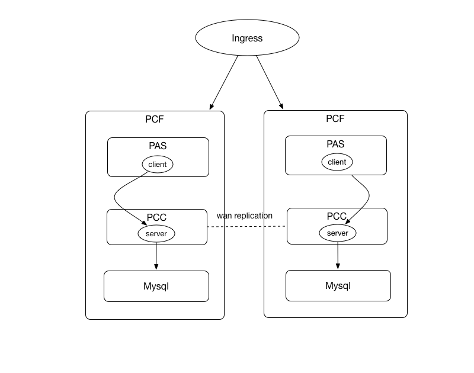
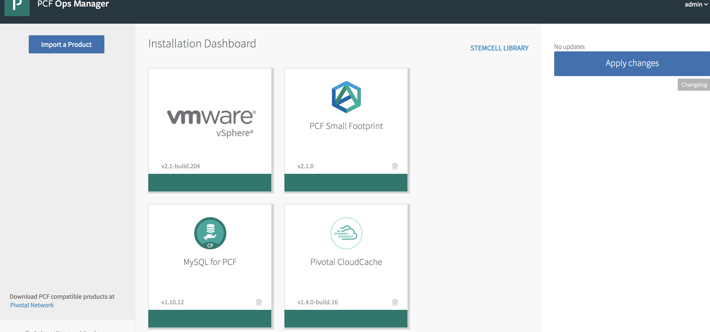
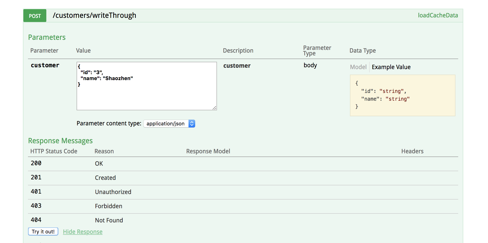
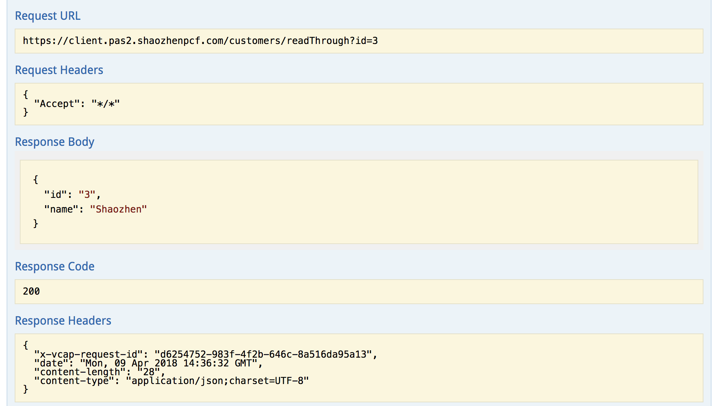
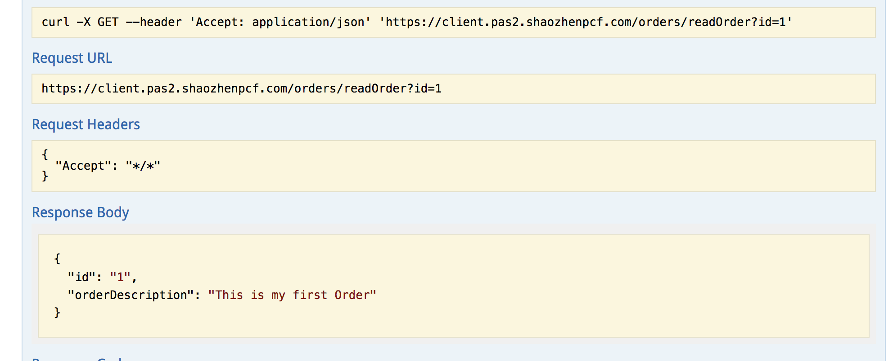

# Look aside and inline(read+write/through) cache with PCC

  * [Inline Cache](https://docs.pivotal.io/p-cloud-cache/1-3/app-development.html#inline-cache)

  * [Look Aside Cache](https://docs.pivotal.io/p-cloud-cache/1-3/app-development.html#lookaside-cache)

  **Thanks to Charlie Black's server side code (https://github.com/charliemblack/basic-geode-read-write-through) and Jeff Cherng's client side code reference (https://github.com/jcherng-pivotal/gemfire-demo)**



## Purpose

* Demo server side code with inline cache loader and cache writer
* Demo wan replication to replicate the system records (Mysql) across two sites
* Demo Spring gemfire code on client side

## Setup two foundations with PAF, PCC and Mysql


[PCF](https://docs.pivotal.io/pivotalcf/)
[PCC](https://docs.pivotal.io/p-cloud-cache/1-3/index.html)
[MYSQL](http://docs.pivotal.io/p-mysql/1-10/index.html)

[Access PAAS ](https://docs.pivotal.io/p-cloud-cache/1-3/developer.html#accessing)

## Build and Deploy

* Create mysql and PCC service and service keys for both foundations

  ```
  cf create-service mysql 100mb mysql
  # Site1 distributed_system_id = 0, Site2 distributed_system_id = 1
  cf create-service p-cloudcache extra-small pcc -c -c '{
  "distributed_system_id" : ID-VALUE }'
  cf create-service-key mysql mysql-key
  cf create-service-key pcc pcc-key
  ```
* Build

  The server side cache needs to talk with mysql. **Currently the mysql credentials are hard coded into the hibernate.xml**

  mysql credentials can be found from the service key ```cf service-key mysql mysql-key ```

  ```
  mvn clean package
  ```

* Setup wan replication on both system (using gfsh)

  Grab remote site credential (```cf service-key pcc pcc-key```) and setup on the local service

  ```
  cf update-service pcc -c '
  {
    "remote_clusters":[
    {
      "remote_locators":[
        "Locator 1",
        "Locator 2",
        "Locator 3"
      ],
      "trusted_sender_credentials":[
      {
        "username":"gateway_sender_jPWG8DkCd5ipHDLaw7XA",
        "password":"XXXXXXXXXX"
      }]
    }]
  }'
  ```

* Setup Site 1 (using gfsh)

  ```
  deploy --jar=${PROJECT_DIR}/server/target/server-0.0.1-SNAPSHOT-jar-with-dependencies.jar
  ```

  Create gateway sender
  ```
  create gateway-sender --id=send_to_1 --remote-distributed-system-id=1 --enable-persistence=true
  ```

  Create customer region for inline cache and wan replication demo
  ```
  create region --name=customers --gateway-sender-id=send_to_1 --type=PARTITION_REDUNDANT --cache-loader=io.pivotal.solutions.pcc.server.CustomerCacheLoader --cache-writer=io.pivotal.solutions.pcc.server.CustomerCacheWriter
  ```

  Create Order region for look aside demo
  ```
  create region --name=orders --type=PARTITION_REDUNDANT
  ```

* Setup Site 2 (using gfsh)

* Push the client side code to both PCF foundations

  ```
  cd client
  cf push
  ```

## Demo the inline cache and wan replication

* Using Swagger UI to do rest calls

  ```
  https://[APP_URL]/swagger-ui.html
  ```
* Post a customer object at **site 1**

  Use customer controller to write through a customer object
  

* Validate that the customer exists at **site 2**

  Use customer controller to read through a customer object
  

* Further validate the object exists in both sites' mysql DB

  ```
  select * from customer;
  ```

## Demo look aside cache (Single site)

 * Load an order to DB directly **Not Through cache**

 * Read an order through Cache

   Cache miss. It will load from DB and fill up the cache. There is a 3 seconds delay in the code to simulate the slowness.
   

 * Read the order again

   The order should return immediately and avoid 3 seconds delay

## Current Problem

* Server side DB connection hard coding   
